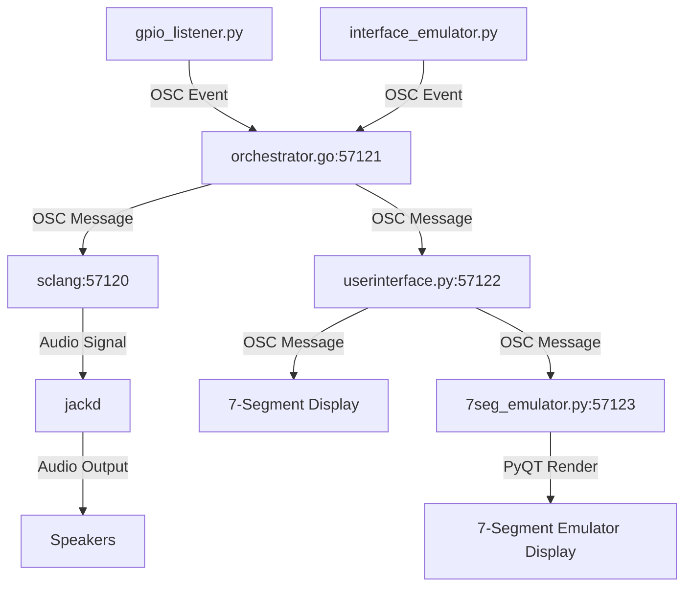

# dronecore

## Pre-requisites

```
npm install -g pm2
```

## Start

```
pm2 flush
pm2 delete all
pm2 start ecosystem.config.js
```


```
jack -d alsa

air

./testui.py

sclang -D timeandspace.scd
```


Processes:
- gpio_listener.py 
  - sends osc events to the orchestrator.go
- interace_emulator.py
  - sends osc events to the orchestrator.go
- orchestrator.go (osc 57121)
  - sends osc events to sclang 
  - sends osc events to userinterface.py
- sclang (osc 57120) sends audio to jackd
- jackd sends audio to speakers
- 7seg_emulator.py (osc 57123) uses PyQT to display 7-segment display
- userinteface.py (osc 57122)
  - send messages to 7-segment display
  - sends messages to 7seg_emulator.py

