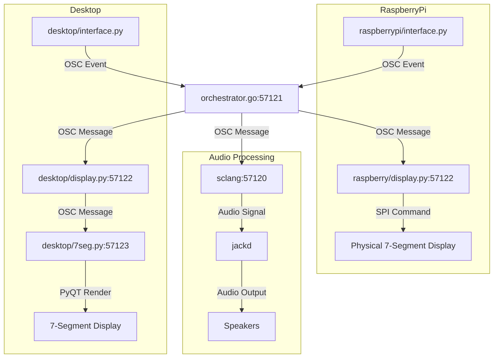

# dronecore

## Pre-requisites

```
npm install -g pm2
```

## Start

```
pm2 flush
pm2 delete all
pm2 start ecosystem.config.js
```


```
jack -d alsa

air

./testui.py

sclang -D timeandspace.scd
```


Processes:
- raspberrypi/interface.py 
  - sends osc to the orchestrator.go
- desktop/interface.py
  - sends osc to the orchestrator.go
- orchestrator.go (osc 57121)
  - sends osc to sclang 
  - sends osc to desktop/display.py
  - sends osc to raspberrypi/display.py
- sclang (osc 57120) sends audio to jackd
- jackd sends audio to speakers
- desktop/display.py (osc 57122)
  - sends osc to desktop/7seg.py
- desktop/7seg.py (osc 57123)
  - display 7-segment display using PyQT
- raspberry/display.py (osc 57122)
  - sends spi commands to 7-segment display

